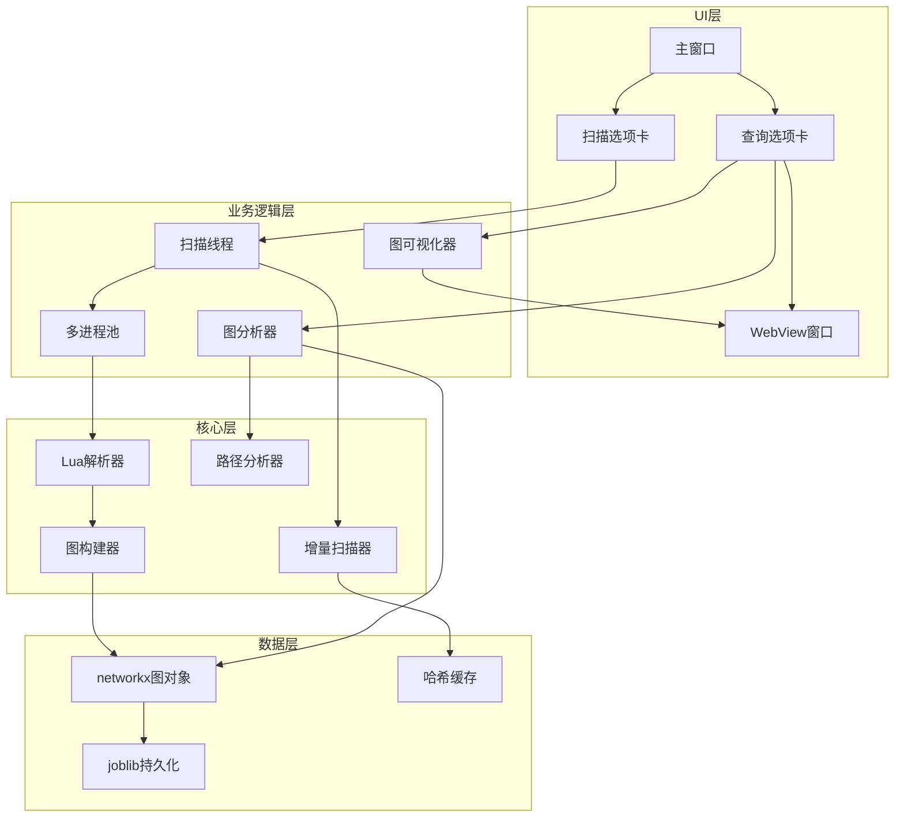

## 用户需求

用户希望对 Lus4n 项目进行全面优化,按照 P0-P3 优先级分阶段实现。

## 产品概述

Lus4n 是一个 Lua 代码调用图生成和分析工具,提供 GUI 和命令行两种模式。本次优化将在现有基础上,提升用户体验、性能和功能完整性。

## 核心功能

### P0 优先级(必须实现)

- 精确进度显示: 扫描时显示"已扫描 X/Y 个文件"的精确进度条
- 内嵌 WebView: 在 GUI 窗口内直接显示可视化图形,无需打开外部浏览器

### P1 优先级(高优先级)  

- 双向查询功能: 支持查看函数的调用者(祖先)和被调用者(后代)的双向关系
- 多进程并行扫描: 使用多进程池并行处理文件扫描,提升大型项目扫描性能

### P2 优先级(中优先级)

- 增量扫描: 基于文件哈希检测变化,只扫描修改过的文件
- 调用路径分析: 分析并显示从函数 A 到函数 B 的所有可能调用路径
- 热点函数分析: 自动识别并高亮显示被频繁调用的核心函数
- 导出功能: 支持将可视化图形导出为 PNG、PDF、GraphML 等格式

### P3 优先级(低优先级)

- 更智能的正则解析: 改进正则表达式解析器,处理嵌套函数、匿名函数、方法调用等复杂场景
- 完善测试: 为核心模块添加单元测试覆盖
- 配置管理: 支持保存和加载扫描配置、可视化样式等用户设置
- 插件化架构: 设计插件接口,支持扩展到其他编程语言

## 技术栈

### 现有技术栈

- GUI 框架: PySide6 6.8.2.1
- 图分析: networkx 3.4.2
- 可视化: pyvis 0.3.2
- 其他: joblib 1.4.2, xxhash 3.5.0, tqdm 4.67.1, loguru 0.7.3, luaparser 3.3.0

### 新增依赖

- PySide6-WebEngine: 用于内嵌 WebView 显示可视化图形
- Pillow: 用于图形导出功能(PNG 格式)
- selenium + chromedriver: 用于导出 PDF/PNG 格式

## 实现方案

### P0: 精确进度显示

**实现策略:**
在扫描前预先统计文件总数,然后在扫描过程中通过信号实时更新进度

**技术细节:**

1. 在 `ScanThread.run()` 中,收集文件阶段结束后,获取 `len(will_scan)` 作为总数
2. 新增信号 `update_progress = Signal(int, int)` 传递当前进度和总数
3. 在 `scan_tab.py` 中连接信号,更新进度条: `self.progress_bar.setRange(0, total)` 和 `self.progress_bar.setValue(current)`
4. 状态栏同时显示百分比文本

**性能考虑:**

- 信号发送频率控制: 每处理 5 个文件更新一次,避免过于频繁的 UI 更新

### P0: 内嵌 WebView

**实现策略:**
使用 PySide6.QtWebEngineWidgets.QWebEngineView 在 GUI 内显示可视化 HTML

**技术细节:**

1. 新增 `WebViewWindow` 类继承 `QMainWindow`,封装 `QWebEngineView`
2. 在 `query_tab.py` 中,生成可视化后调用 `WebViewWindow` 显示 HTML
3. 支持在新窗口中打开,也支持在分割窗口中内嵌显示
4. 处理本地文件加载权限: 设置 `QWebEngineSettings.LocalContentCanAccessFileUrls`

**兼容性处理:**

- 检测 PySide6-WebEngine 是否安装,如未安装则回退到浏览器打开方式
- 在 requirements.txt 中添加可选依赖说明

### P1: 双向查询功能

**实现策略:**
扩展 `GraphAnalyzer` 类,新增获取后代节点的方法,UI 中增加查询模式选择

**技术细节:**

1. 在 `graph_analyzer.py` 中新增方法:

- `get_function_descendants(function_name)`: 获取后代节点(被调用者)
- `get_function_bidirectional(function_name)`: 获取双向关系(祖先+后代)

2. 在 `ui_components.py` 的 `FunctionQueryInput` 中添加查询模式下拉框: "调用者"、"被调用者"、"双向关系"
3. 在 `query_tab.py` 的 `query_function()` 中根据模式调用不同方法
4. 可视化时用不同颜色区分调用者和被调用者

**复杂度分析:**

- `nx.descendants()` 时间复杂度 O(V+E),与 `nx.ancestors()` 相同
- 双向查询需要合并两个集合,复杂度 O(V+E)

### P1: 多进程并行扫描

**实现策略:**
使用 `multiprocessing.Pool` 并行调用 `scan_one_file`,主线程聚合结果

**技术细节:**

1. 在 `scan_thread.py` 中:

- 使用 `multiprocessing.Pool(cpu_count())` 创建进程池
- 使用 `pool.imap_unordered()` 异步处理文件列表
- 主线程通过回调聚合结果并更新进度

2. 在 `graph.py` 中确保 `scan_one_file` 可被 pickle 序列化
3. 使用 `multiprocessing.Manager` 共享进度计数器

**性能优化:**

- 进程数: `min(cpu_count(), len(will_scan)//10)`,避免进程过多导致开销
- 批处理: 使用 `chunksize` 参数减少进程间通信开销
- 预期性能提升: 4-8 核 CPU 可提升 2-4 倍扫描速度

**风险控制:**

- 捕获子进程异常,避免单个文件错误导致整体失败
- 提供开关选项,允许用户切换单进程/多进程模式

### P2: 增量扫描

**实现策略:**
在存储文件中保存文件哈希表,扫描时对比哈希值判断是否需要重新扫描

**技术细节:**

1. 扩展存储数据结构,新增 `file_hashes` 字段: `{file_path: (hash, mtime)}`
2. 在 `scan_thread.py` 中:

- 加载现有哈希表
- 对每个文件计算 `xxhash.xxh64(content).hexdigest()`
- 对比哈希值,相同则跳过扫描,直接复用旧数据

3. 在 UI 中显示增量扫描统计: "跳过 X 个未修改文件,扫描 Y 个新/修改文件"

**空间开销:**

- 每个文件哈希约 16 字节,1万个文件约 160KB,可接受

### P2: 调用路径分析

**实现策略:**
使用 `nx.all_simple_paths()` 计算两个函数间的所有简单路径

**技术细节:**

1. 在 `graph_analyzer.py` 中新增方法:

- `find_call_paths(source, target, max_depth=10)`: 查找所有路径
- `find_shortest_call_path(source, target)`: 查找最短路径

2. 在 `query_tab.py` 中新增"路径分析"按钮和两个函数输入框
3. 结果以列表形式显示路径: `A -> B -> C -> D`
4. 可视化时高亮路径上的节点和边

**性能考虑:**

- 限制路径长度 `max_depth=10`,避免指数级爆炸
- 限制返回路径数量(如前 100 条),超过则提示

### P2: 热点函数分析

**实现策略:**
按入度(被调用次数)排序,自动识别 Top-N 热点函数

**技术细节:**

1. 在 `graph_analyzer.py` 中新增方法:

- `get_hotspot_functions(top_n=20)`: 返回被调用次数最多的前 N 个函数

2. 在 `query_tab.py` 中新增"热点分析"选项卡:

- 表格显示热点函数、调用次数、影响范围
- 支持点击跳转到该函数的调用关系可视化

3. 可视化时用红色高亮热点函数

### P2: 导出功能

**实现策略:**

- PNG/PDF: 使用 selenium 控制 Chrome 截图/打印
- GraphML: 使用 `nx.write_graphml()` 导出 networkx 图

**技术细节:**

1. 在 `graph_visualizer.py` 中新增方法:

- `export_to_png(html_path, output_path)`: 截图导出
- `export_to_pdf(html_path, output_path)`: 打印导出
- `export_to_graphml(graph, nodes, output_path)`: 导出 GraphML

2. 在 `query_tab.py` 中添加"导出"按钮和格式选择下拉框
3. 使用 selenium 的 headless 模式,避免弹出浏览器窗口

**依赖管理:**

- selenium 和 chromedriver 作为可选依赖
- 如未安装,隐藏 PNG/PDF 导出选项,仅保留 GraphML

### P3: 更智能的正则解析

**实现策略:**
改进 `extract_info_with_regex()` 函数,使用更复杂的正则表达式和状态机

**技术细节:**

1. 在 `graph.py` 中重写 `extract_info_with_regex()`:

- 处理嵌套函数: 使用栈跟踪 `function ... end` 配对
- 处理匿名函数: 识别 `function(...) ... end` 模式
- 处理方法调用: 识别 `obj:method()` 和 `obj.method()` 模式
- 处理局部函数: 识别 `local function` 声明

2. 保持向后兼容,在简单正则失败时才使用复杂解析

### P3: 完善测试

**实现策略:**
为核心模块编写单元测试,使用 pytest 框架

**技术细节:**

1. 新建 `tests/` 目录,包含:

- `test_graph.py`: 测试 `scan_one_file`, `scan_path`
- `test_analyzer.py`: 测试 `GraphAnalyzer` 的各种查询方法
- `test_visualizer.py`: 测试可视化渲染

2. 准备测试数据: 在 `tests/fixtures/` 中放置示例 Lua 文件
3. 使用 mock 隔离外部依赖(如文件系统、浏览器)
4. 目标覆盖率: 核心模块达到 70% 以上

### P3: 配置管理

**实现策略:**
扩展 `QSettings` 使用,保存更多用户配置

**技术细节:**

1. 在 `main_window.py` 中扩展 `save_settings()` 和 `load_settings()`:

- 保存可视化设置: 布局方式、物理引擎开关、节点筛选规则
- 保存扫描配置: 文件后缀、是否启用多进程、是否增量扫描

2. 新增"设置"菜单,提供配置界面
3. 支持导入/导出配置文件(JSON 格式)

### P3: 插件化架构

**实现策略:**
设计抽象接口 `LanguageParser`,将 Lua 解析器实现为插件

**技术细节:**

1. 新建 `lus4n/parsers/` 目录:

- `base.py`: 定义 `LanguageParser` 抽象基类
- `lua_parser.py`: 将现有 Lua 解析逻辑迁移到此

2. 在 `graph.py` 中动态加载解析器:

- 根据文件后缀选择解析器
- 支持用户自定义解析器路径

3. 提供插件开发文档和示例(如 Python 解析器)

**扩展性设计:**

- 接口方法: `parse_file(file_path) -> call_graph`
- 插件发现: 扫描 `parsers/` 目录下的 `.py` 文件
- 插件注册: 使用装饰器 `@register_parser(extensions=['.py'])`

## 架构设计

### 系统架构图



### 数据流设计

**扫描流程(带增量优化):**

1. 用户选择路径 → 2. 遍历文件 → 3. 加载哈希缓存 → 4. 计算文件哈希 → 5. 对比判断是否需要扫描 → 6. 多进程并行扫描 → 7. 聚合结果 → 8. 保存图数据和哈希缓存

**查询流程(双向查询):**

1. 用户输入函数名和查询模式 → 2. 加载图数据 → 3. 根据模式调用分析器(祖先/后代/双向) → 4. 筛选节点 → 5. 渲染可视化 → 6. 显示在 WebView 中

**路径分析流程:**

1. 用户输入起点和终点函数 → 2. 调用 `nx.all_simple_paths()` → 3. 限制路径长度和数量 → 4. 格式化显示路径列表 → 5. 可视化高亮路径

## 目录结构

### 修改和新增文件说明

```
d:/Repos/lus4n/
├── lus4n/
│   ├── graph.py                      # [MODIFY] 改进正则解析,支持多进程序列化
│   ├── parsers/                      # [NEW] 插件化解析器目录
│   │   ├── __init__.py              # [NEW] 解析器包初始化,提供插件加载机制
│   │   ├── base.py                  # [NEW] 定义 LanguageParser 抽象基类接口
│   │   └── lua_parser.py            # [NEW] Lua 解析器实现,迁移自 graph.py
│   └── ui/
│       ├── scan_thread.py           # [MODIFY] 实现精确进度信号、多进程扫描、增量扫描
│       ├── scan_tab.py              # [MODIFY] 连接精确进度信号,更新进度条显示
│       ├── main_window.py           # [MODIFY] 扩展配置管理,保存可视化和扫描设置
│       ├── query_tab.py             # [MODIFY] 新增双向查询、路径分析、热点分析、导出功能
│       ├── graph_analyzer.py        # [MODIFY] 新增后代查询、双向查询、路径分析、热点分析方法
│       ├── graph_visualizer.py      # [MODIFY] 新增导出为 PNG/PDF/GraphML 的方法
│       ├── ui_components.py         # [MODIFY] 新增查询模式选择、路径分析输入组件
│       ├── webview_window.py        # [NEW] WebView 窗口类,封装 QWebEngineView 显示 HTML
│       └── export_utils.py          # [NEW] 导出工具类,封装 selenium 截图和 networkx 导出逻辑
├── tests/                            # [NEW] 测试目录
│   ├── __init__.py                  # [NEW] 测试包初始化
│   ├── test_graph.py                # [NEW] 测试 graph.py 的扫描函数
│   ├── test_analyzer.py             # [NEW] 测试 GraphAnalyzer 的查询方法
│   ├── test_visualizer.py           # [NEW] 测试 GraphVisualizer 的渲染方法
│   └── fixtures/                    # [NEW] 测试数据目录
│       ├── sample1.lua              # [NEW] 示例 Lua 文件用于测试
│       └── sample2.lua              # [NEW] 示例 Lua 文件用于测试
├── requirements.txt                  # [MODIFY] 新增 PySide6-WebEngine, Pillow, selenium 等依赖
└── README.MD                         # [MODIFY] 更新功能说明,添加新功能使用文档
```

### 关键文件职责说明

**lus4n/ui/scan_thread.py [MODIFY]**

- 职责: 后台扫描线程,负责文件扫描和进度更新
- 新增功能: 
- 精确进度信号 `update_progress(current, total)`
- 多进程并行扫描逻辑
- 增量扫描:加载哈希缓存、对比哈希、跳过未修改文件
- 实现要点: 使用 `multiprocessing.Pool` 并行处理,主线程聚合结果并发送进度信号

**lus4n/ui/query_tab.py [MODIFY]**

- 职责: 查询选项卡,处理函数查询和可视化
- 新增功能:
- 双向查询模式选择(调用者/被调用者/双向)
- 路径分析功能:输入起点和终点,显示所有路径
- 热点分析功能:显示 Top-N 被调用最多的函数
- 导出功能:导出为 PNG/PDF/GraphML
- 实现要点: 根据查询模式调用 GraphAnalyzer 的不同方法,使用 WebViewWindow 显示可视化

**lus4n/ui/graph_analyzer.py [MODIFY]**

- 职责: 图分析器,提供各种查询和分析方法
- 新增功能:
- `get_function_descendants(function_name)`: 获取后代节点
- `get_function_bidirectional(function_name)`: 获取双向关系
- `find_call_paths(source, target, max_depth)`: 查找调用路径
- `find_shortest_call_path(source, target)`: 查找最短路径
- `get_hotspot_functions(top_n)`: 获取热点函数
- 实现要点: 使用 networkx 的图算法(descendants, all_simple_paths 等)

**lus4n/ui/webview_window.py [NEW]**

- 职责: WebView 窗口,在 GUI 内显示可视化 HTML
- 功能:
- 封装 QWebEngineView 组件
- 加载本地 HTML 文件并显示
- 处理本地文件访问权限
- 提供缩放、刷新等控制按钮
- 实现要点: 使用 PySide6.QtWebEngineWidgets.QWebEngineView,设置 LocalContentCanAccessFileUrls 权限

**lus4n/ui/export_utils.py [NEW]**

- 职责: 导出工具类,封装各种导出逻辑
- 功能:
- `export_html_to_png(html_path, output_path, width, height)`: 使用 selenium 截图
- `export_html_to_pdf(html_path, output_path)`: 使用 selenium 打印 PDF
- `export_graph_to_graphml(graph, nodes, output_path)`: 导出 networkx 图为 GraphML
- 实现要点: 使用 selenium 的 headless Chrome,设置窗口大小和截图参数

**lus4n/parsers/base.py [NEW]**

- 职责: 定义语言解析器抽象接口
- 功能:
- `LanguageParser` 抽象基类,定义 `parse_file(file_path)` 方法
- `register_parser` 装饰器,用于注册解析器
- `get_parser_for_file(file_path)` 函数,根据文件后缀选择解析器
- 实现要点: 使用 ABC 模块定义抽象类,维护解析器注册表

**tests/test_graph.py [NEW]**

- 职责: 测试 graph.py 的扫描函数
- 测试用例:
- 测试 `scan_one_file` 解析正确的 Lua 文件
- 测试 `scan_one_file` 处理语法错误文件(回退到正则解析)
- 测试 `scan_path` 扫描整个目录
- 测试多进程扫描结果与单进程一致性
- 实现要点: 使用 pytest fixtures 准备测试数据,mock 文件系统��
- 实现要点: 使用 pytest fixtures 准备测试数据,mock 文件系统